# Data Pipeline With AWS and Snowflake
This is the first capstone project of the data engineering bootcamp from WeCloudData.


## 1. Overview
This project entails typical Analytical Data Engineering, involving the ingestion of data from various sources and its loading into the Snowflake data warehouse. Within the warehouse, after undergoing a series of data transformation processes, we prepare the data for Business Intelligence (BI) usage. The BI tool Metabase connects to the data warehouse to generate diverse dashboards and reports.


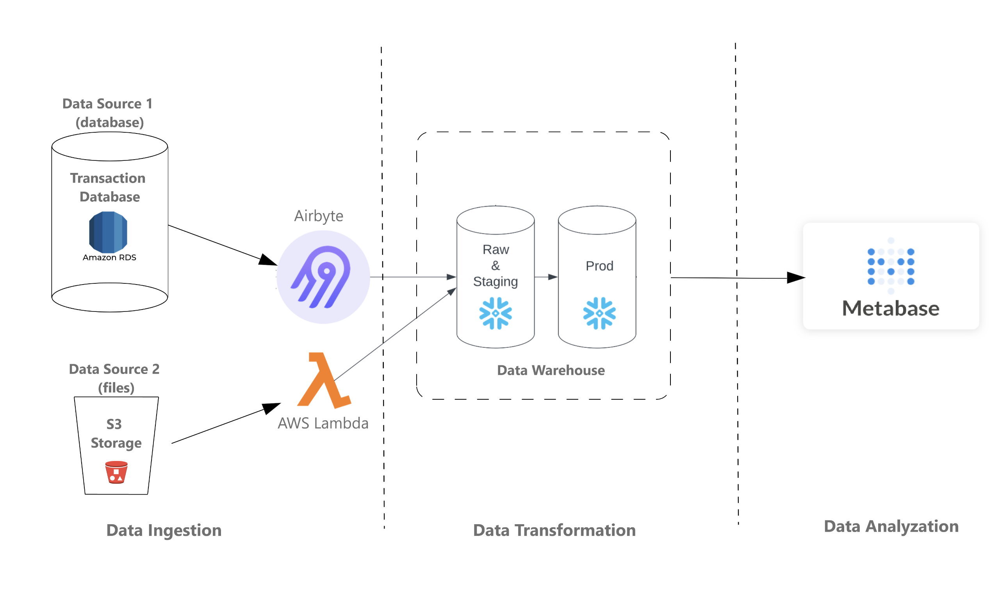


## 2. About The Data
### Data Background
The dataset utilized originates from [TPCDS](https://www.tpc.org/tpcds/), a well-known dataset designed for database testing, with a specific emphasis on Retail Sales. It encompasses sales records from both websites and catalogs, along with detailed information on inventory levels for each item within every warehouse. Moreover, it incorporates 15 dimensional tables containing valuable information about customers, warehouses, items, and more.
The dataset is divided into two parts:
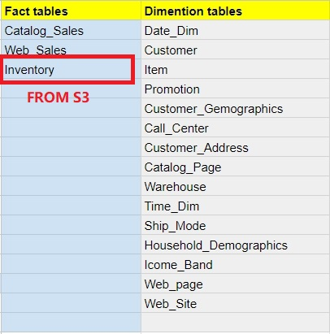

In order to have the data on the two sources, you can store the data on the two sources as follows:
1. **RDS**: All tables, except for the inventory tables, are housed in the Postgres DB on AWS RDS. These tables undergo daily refreshes, ensuring they are consistently updated with the latest data. To access the most recent information, it is necessary to execute the ETL process on a daily basis.
2. **S3 Bucket**: The sole Inventory table is hosted in an S3 bucket. Each day, a new file containing the latest data is deposited into the S3 bucket. However, it's important to note that the inventory table typically captures data only at the end of each week. Consequently, on most occasions, you will find only one entry per item in each warehouse for each week (please refer to your RAW schema in Snowflake to explore the data). Despite this, it's necessary to ingest the inventory file from the S3 bucket on a daily basis.

By using a service like AWS Lambda, you may achieve the simulation of the data ingestion to RDS and S3.


## 3. Tables in its schema
Multiple tables related to customers are organized horizontally. When constructing the data model, kindly consolidate these tables into a unified customer dimension table.
### 3.1 Fact Tables
#### 3.1.1 Catalog Sales (cs)
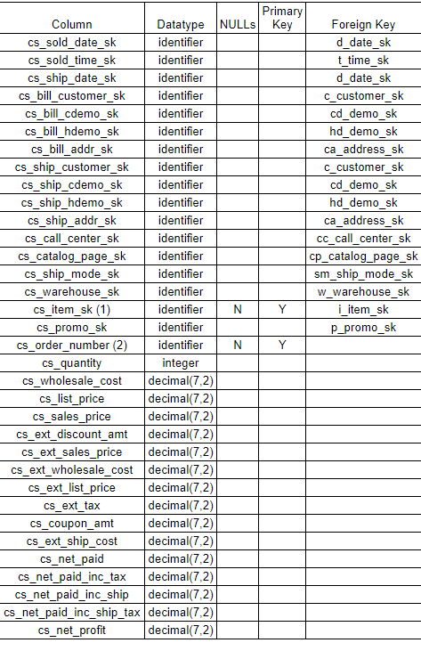
#### 3.1.2 Web_Sales (ws)
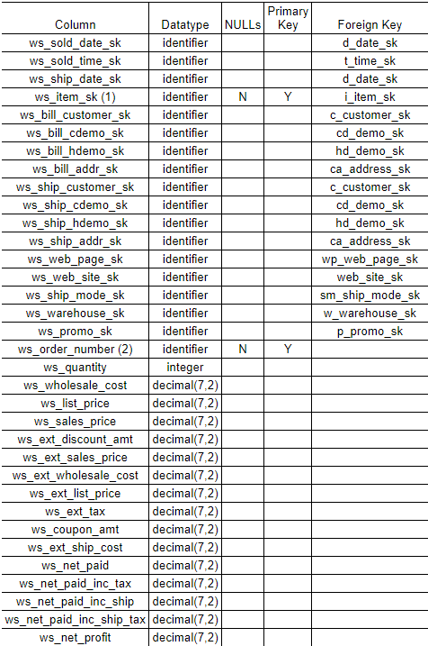
#### 3.1.3 Inventory (inv)
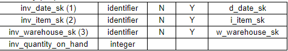
### 3.2 Dimension Tables
#### 3.2.1 Customer (c)
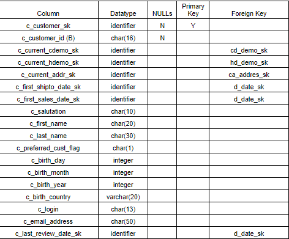
#### 3.2.2 Customer_address (ca)
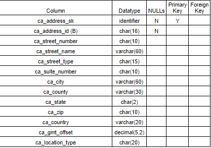
#### 3.2.3 Customer_demographics (cd)
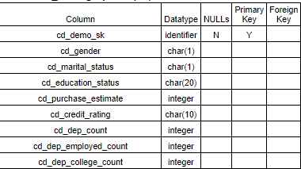
#### 3.2.4 Household_demographics (hd)
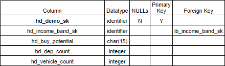
#### 3.2.5 Income_band (ib)
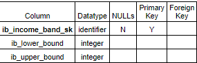
#### 3.2.6 item (i)
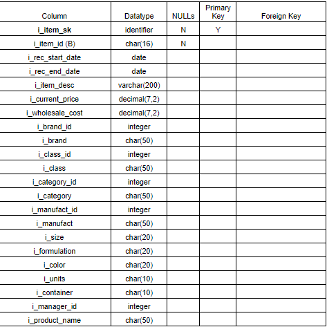
#### 3.2.7 Warehouse (w)
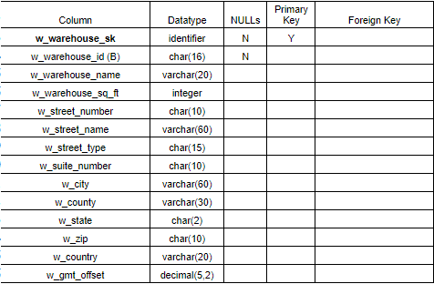
#### 3.2.8 Web_page (wp)
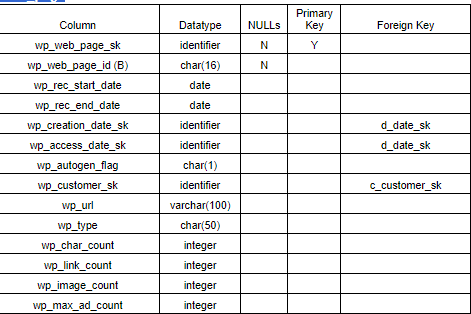
#### 3.2.9 Web_site	(web)
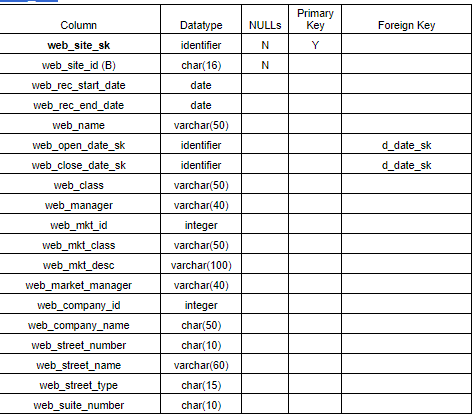
#### 3.2.10 Date_dim (d)
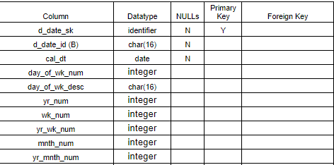
#### 3.2.11 Time_dim (t)
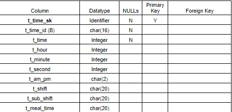
#### 3.2.12 Promotion (p)
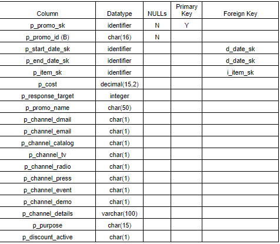
#### 3.2.13 Ship_mode (sm)
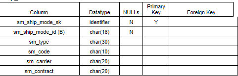
#### 3.2.14 Call_center (cc)
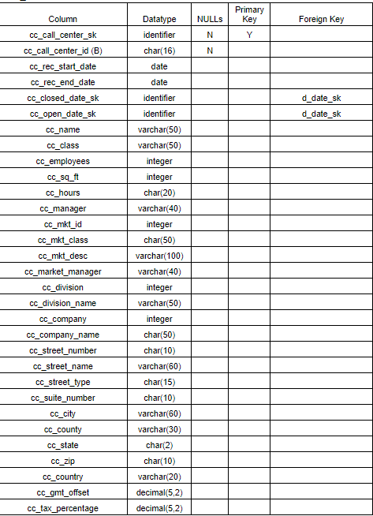
#### 3.2.15 Catalog_page (cp)
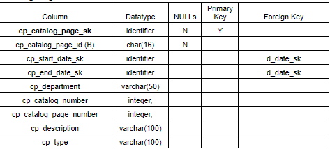


## 4. Business Requirements
### 4.1 BI Tool Requirements
The objective is to generate dashboards and reports using the BI tool Metabase. It is essential to comprehend the requirements for Metabase dashboards and reports:
1. Determine the top and bottom-performing items of the week by analyzing sales amounts and quantities.
2. how items with low inventory levels on a weekly basis.
3. Identify items with low stock levels, including their associated week and warehouse numbers, marked as "True".

Based on these requirements, we need to know the sales amounts and quantities, inventory details from the inventory table, and a synthesis of sales and inventory data for metric calculations. Regarding dimension tables, we need information about items, weeks, warehouses, etc., requiring the dimension tables Item, Warehouse, and Date.

However, if we only based on the above business requirements in Metabase, it's challenging to define the data model. So we need to introduce new columns and tables (Data Model) in the data warehouse to meet these reporting requirements.

### 4.2 Snowflake Data Warehouse Requirements
In order to meet the BI requirements, we need to create new tables in the data warehouse. Here are the requirements for the new tables:
1. Consolidate certain raw tables, for example, merging various customer-related tables into a single table.
2. As all BI requirements are on a weekly basis, establish a new fact table weekly, incorporating multiple additional metrics:
    - **sum_qty_wk:** The sum of sales_quantity for this week.
    - **sum_amt_wk:** The sum of sales_amount for this week.
    - **sum_profit_wk:** The sum of net_profit for this week.
    - **avg_qty_dy:** The average daily sales_quantity for this week (= sum_qty_wk/7).
    - **inv_on_hand_qty_wk:** The item’s inventory on hand at the end of each week in all warehouses (= The inventory on hand at the end of this week).
    - **wks_sply:** Weeks of supply, an estimated metric to see how many weeks the inventory can supply the sales (inv_on_hand_qty_wk/sum_qty_wk).
    - **low_stock_flg_wk:** Low stock weekly flag. For example, if there is a single day where (avg_qty_dy > 0 && (avg_qty_dy > inventory_on_hand_qty_wk)) in the week, then mark this week's flag as `True`.

When creating the BI reports in Metabase by the mertics above.


## 5. Project Infrastructure
In this project, the entire infrastructure is constructed in the cloud:
- **Servers:** Create several servers on the AWS cloud.
- **Tools:** Install various tools on these servers, including Airbyte for data ingestion, and Metabase as the BI tool for building dashboards.
- **Cloud Data Warehouse:** Create an account on Snowflake. Then, use Snowflake, the cloud data warehouse, to store data and perform data transformation.
- **AWS Lambda:** Use AWS Lambda, a serverless service, to ingest data from AWS data storage (S3).


The project has three stages/parts, and as seen in thie [diagram](#1-overview):
1. **Extraction and Ingestion Process**: The first part of the project involves Data Ingestion. It entails connecting to two data sources: the Postgres database and the AWS S3 bucket. Utilizing Airbyte, establish a connection to the `raw_st` schema* of the Postgres database on AWS RDS, and transfer all tables to the Snowflake data warehouse. In addition, leverage AWS Lambda to connect to the AWS S3 bucket and transfer the file named `inventory.csv`* from the S3 bucket to the Snowflake data warehouse.
2. **Data Modeling & Transformation For Snowflake**: The next stage of the project focuses on data transformation within the Snowflake data warehouse. This involves reshaping tables from their original structure to the desired format. Throughout this phase, tasks include creating a data model, developing ETL scripts, and establishing a schedule for the data loading process.
3. **Data Loading**: In the last part of this project, establish a connection between the Snowflake data warehouse and the BI tool (Metabase). This connection allows for the creation and display of dashboards and reports in Metabase, utilizing the data stored in Snowflake.

\* **VERY IMPORTANT**: The data can be found [here](https://www.tpc.org/tpcds/) and then put to simulate the process from the RDS and S3.

## 6. Building The Data Pipeline
### 6.1 The Extraction and Ingestion Process
#### Creating AWS Lambda, Snowflake, and Airbyte
**Notes:** 
- Please make sure to have AWS account.
- As stated above you can simulate the process of having the datasets from the source [here](https://www.tpc.org/tpcds/) by placing them in RDS and S3.
#### AWS Lambda:
- You can create the AWS Lambda from the AWS Services and copying the Lambda function from the [source code](https://github.com/SaudiJedi/data-pipeline-aws-snowflake/blob/master/code/lambda_function.py).
- In order to have the dependencies, you must add a layer to your lambda function, and below is a quick way to add a layer:
    - Open your AWS Cloudshell, and run the following commands:
    ```
    mkdir -p lambda_layers/python/lib/python3.9/site-packages
    python3 -m venv venv
    source venv/bin/activate
    ```
    - install the dependencies in the desired folder **(You will realize that we are not using requirements.txt file here and pip3 install command is also using multiple flags. This is because lambda backend containers are using older packages which makes it difficult to install it using other methods)**:
    ```
    pip3 install --platform manylinux2010_x86_64 --implementation cp --python 3.9 --only-binary=:all: --upgrade --target lambda_layers/python/lib/python3.9/site-packages snowflake-connector-python==2.7.9
    ```
    (Please review this [link](https://stackoverflow.com/questions/75472308/aws-lambda-returns-lib64-libc-so-6-version-glibc-2-28-not-found) for more information)

    - Zip the `lambda_layers` folder:
    ```
    cd lambda_layers
    zip -r snowflake_lambda_layer.zip *
    ```
    - Publish layer:
    ```
    aws lambda publish-layer-version \
    --layer-name fl-snowflake-lambda-layer \
    --compatible-runtimes python3.9 \
    --zip-file fileb://snowflake_lambda_layer.zip
    ```
    - Choose this layer from the Lambda Configs.
    - To add the Snowflake keys to your Lambda, please refer to the docs [here](https://docs.aws.amazon.com/lambda/latest/dg/configuration-envvars.html).
#### Airbyte
- Create an EC2 instance with the following specs:
    - Type: t2.large
    - AMI: Ubuntu Server 22.04 LTS (free tier)
    - Firewall: Allow all traffic to 0.0.0.0/0
    - Storage: 20 GB

- You can [this doc](https://docs.airbyte.com/deploying-airbyte/on-aws-ec2) to install Airbyte in your EC2.
- Make sure to create an inbound security group to have Airbyte's server listening on port `8000` if applicable.
- Test accessing the Airbyte UI
- Now [configure the connection](https://airbyte.com/how-to-sync/postgresql-to-snowflake-data-cloud) between your RDS and Snowflake through Airbyte.
- Be sure to set a cron to run the data pulling from RDS to Snowflake every midnight.
- You need to upload the EC2 key to the Cloud Shell before you can SSH the EC2 instance, and understand why do we need the EC2 Key.
- You should know how to exit EC2 and back to Cloud Shell.
#### Snowflake
Make sure to have a Snowflake account with a valid subscription, or [create a new Snowflake account](https://signup.snowflake.com/).
Do the following to create the databases and the schemas:
1. Create a database on your Snowflake account, we can call it TPCDS, and you can find the source code [here](https://github.com/SaudiJedi/data-pipeline-aws-snowflake/blob/master/code/ddl/inventory_table_definition.sql)
2. Create a schema under the database TPCDS, we can call this schema RAW;
3. In your schema "RAW" create a table called "inventory" with the columns and data type like this:
<table>
  <thead>
    <tr>
      <th>NAME</th>
      <th>TYPE</th>
      <th>NULLABLE</th>
      <th>DEFAULT</th>
    </tr>
  </thead>
  <tbody>
    <tr>
      <td>INV_DATE_SK</td>
      <td>Number</td>
      <td>No</td>
      <td>NULL</td>
    </tr>
    <tr>
      <td>INV_ITEM_SK</td>
      <td>Number</td>
      <td>No</td>
      <td>NULL</td>
    </tr>
    <tr>
      <td>INV_QUANTITY_ON_HAND</td>
      <td>Number</td>
      <td>Yes</td>
      <td>NULL</td>
    </tr>
    <tr>
      <td>INV_WAREHOUSE_SK</td>
      <td>Number</td>
      <td>No</td>
      <td>NULL</td>
    </tr>
  </tbody>
</table>

#### Now back to your AWS Lambda tab
- Scheduel the lambda to run every midnight (Your local time) with [EventBridge](https://docs.aws.amazon.com/eventbridge/latest/userguide/eb-run-lambda-schedule.html) to load data from the S3 to Snowflake.
- Now test to see if the tables arrived to your Snowflake db.
#### Now back to your Airbyte
- Test the connection between your RDS (Postgres) and the arrival of the metadata from Airbyte to Snowflake.
- For the Airbyte's EC2, it will be running all the time, [unless scheduled to start and stop](https://docs.aws.amazon.com/systems-manager/latest/userguide/quick-setup-scheduler.html) to save cost.

### 6.2 Data Modeling & Transformation For Snowflake

#### 6.2.1 Understanding The Source data
The dataset, sourced from TPCDS, is renowned for its application in database testing, specifically oriented towards Retail Sales. Within this dataset, you'll find sales records from both the website and catalog, along with comprehensive inventory levels for each item in every warehouse. Furthermore, there are 15 dimensional tables encompassing details about customers, warehouses, items, and more.


#### 6.2.2 Understanding the data modeling process
You can get back to the [buisness requirements](#4-business-requirements) if you want to get the idea of the data modeling process.

Create two schemas for staging inside Snowflake under the `TPCDS`, a product schema that holds the data model we created. We can call it `ANALYTICS`, and a schema called `INTERMEDIATE` which will be used during the ETL process.

**As you can go through the modeling, you can follow these multiple SQL scripts to solve the requirements needs, so please refer to the codes hyperlinked in order to follow up with the data defition**

#### 6.2.3 [data_definition.sql](https://github.com/SaudiJedi/data-pipeline-aws-snowflake/blob/master/code/ddl/data_definition.sql) \(Data Modeling\)
The steps of the data definition from the source code is as follows:
1. Creating the `INTERMEDIATE` schema to process the ingested data on RAW schema and staging it for the production.
2. Creating Customer Snapshot table inside the `INTERMEDIATE` schema which will store the data from all the customer tables as a snapshot to be processed from Customer Dim.
3. Creating the `ANALYTICS` schema which will be the main engine for the METABASE as it defines the main fact table
4. Creation of the `Customer_Dim` inside the `ANALYTICS` which will store the data aggregated and joined from the customer snapshots.
5. Creating the main fact tables which will be the analytical engine.

#### 6.2.4 Stored Procedures \(Data transformation jobs on Snowflake\)

The goal of writing a stored procedure is to run multiple procedural SQL statements together. This means that if you want to run SQL statements together repeatedly, stored procedure can help you with that.
We can also create variables in the stored procedure which is quite helpful when you want to get information from a table and use it to do something. Think about deleting the records with the most recent date from fact table. You can create a variable in stored procedure and populate it using SQL query. This variable can then be used throughout the code.
Stored Procedure can run both DDL and DML statements.

1. [sp_populating_customer_dimension.sql](https://github.com/SaudiJedi/data-pipeline-aws-snowflake/blob/master/code/stored_procedures/sp_populating_customer_dimension.sql) : This stored procedure is for the purpose of developing a merge script to integrate the new Customer dimension table into the existing dimension table within the Analytics schema, following Type 2 methodology.

2. [sp_fact_table_daily_aggregated_sales.sql](https://github.com/SaudiJedi/data-pipeline-aws-snowflake/blob/master/code/stored_procedures/sp_fact_table_daily_aggregated_sales.sql) : 
This stored procedure is for the purpose of developing a merge script to integrate the new Customer dimension table into the existing dimension table within the Analytics schema, following Type 2 methodology.

3. [sp_fact_table_weekly_aggregated_sales.sql](https://github.com/SaudiJedi/data-pipeline-aws-snowflake/blob/master/code/stored_procedures/sp_fact_table_weekly_aggregated_sales.sql) : This stored procedure is for the purpose of creating a script to perform a join between the daily sales fact table and the updated inventory table, creating the weekly sales and inventory fact table within the Analytics schema.

#### 6.2.5 Scheduling

[tasks.sql](https://github.com/SaudiJedi/data-pipeline-aws-snowflake/blob/master/code/tasks/tasks.sql) : 
- The goal of snowflake task is to schedule SQL query to run at a schedule time. This is very similar to cron job except it exists inside Snowflake.
- We will use snowflake tasks to call Stored Procedure which will then run all the queries defined in it on a scheduled time.
- Go to snowflake and open the new worksheet. We will use this worksheet to store all tasks related queries. You can name it Project Tasks.
- Use the code to create tasks for daily sales table. Please note that CALL keyword is used to call stored procedure so use the correct name for it.


### 6.3 Data Load

#### 6.3.1 Creating EC2 Instance For Metabase

Now, you get to create an EC2 for Metabase (A BI tool) that will be the datamart for analytics use.

**Specs of the EC2 for Metabase:**
- **Type:** t2.small
- **AMI:** Ubuntu Server 22.04 LTS (free tier)
- **Firewall:** Allow all traffic to 0.0.0.0/0
- **Storage:** 20 GB

Make sure to set a group policy inbound rule at port `3000` in order for Metabase's server to listen on.

Also make sure to have Docker and Docker Compose installed by following the instructions on [this doc](https://docs.docker.com/engine/install/ubuntu/#install-from-a-package).

#### 6.3.2 Metabase installation and setup
1. Pull the Metabase docker image:
```
docker pull metabase/metabase:latest
```
2. Run the docker container:
```
docker run -d -p 3000:3000 --name metabase metabase/metabase
```
if you want to see the logs as metabase installs then run.  control + c to quit, and run:
```
docker logs -f metabase
```
The above command will launch Metabase server on port 3000 by default. 
Note You will have to wait a few moments for the server to fully start up.

If you want to store the metadata of Metabase in your own database, you can use the following command to run the docker container:
```
docker run -d -p 3000:3000 \
  -e "MB_DB_TYPE=postgres" \
  -e "MB_DB_DBNAME=<metabasea db>" \
  -e "MB_DB_PORT=5432" \
  -e "MB_DB_USER=name" \
  -e "MB_DB_PASS=password" \
  -e "MB_DB_HOST=my-database-host" \
   --name metabase metabase/metabase
```
3. Now validate the installation by accessing Metabse UI through Port `3000`.
4. Connect your Snowflake database, schema ANALYTICS with Metabase, further more about this step [here](https://www.metabase.com/docs/latest/databases/connections/snowflake).

#### 6.3.3 Create A Report Using Metabase
Please generate a report in Metabase based on our business requirements.

Our Metabase purpose is to create dashboard and reports in the BI tool --Metabase. Please follow the requirements to create dashbards in Metabase:

1. Identify the highest and lowest performing items of the week by analyzing sales amounts and quantities.
2. Display items with low supply levels for each week.
3. Detect items experiencing low stock levels, along with their corresponding week and warehouse numbers, marked as "True".


# Results & Conclusion
We built this data pipeline that met the buisness requirements and resulted in the final product and datamart which is Metabase.

## Our Final Dashboard
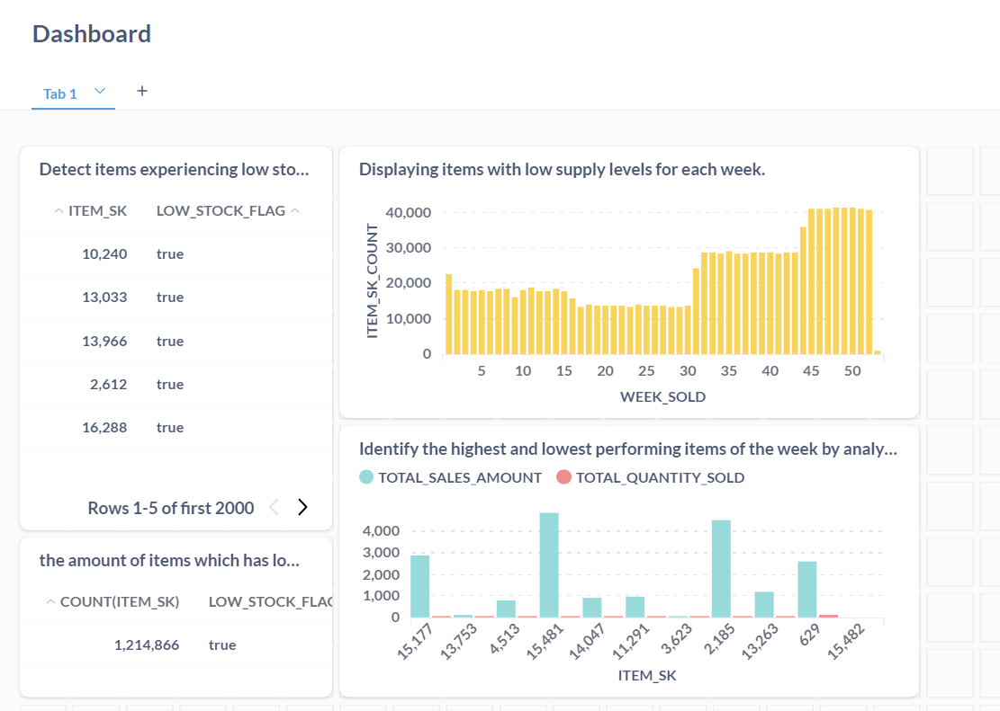

You may want to check out our presentaion [here](https://github.com/SaudiJedi/data-pipeline-aws-snowflake/blob/master/other_files/project_presentation.pdf).

<br><br>


<p style="text-align: center; font-size: 24px;">Thank you for going through the documentation of my first capstone project!</p>
